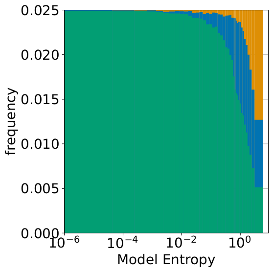
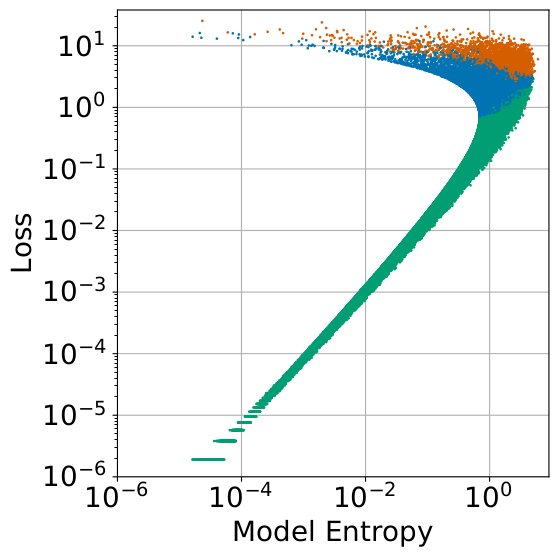
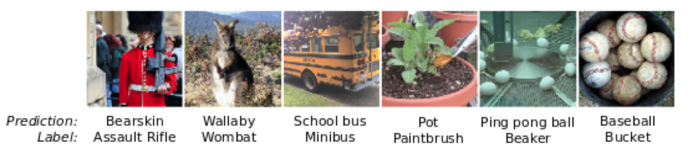

# Empirical Confidence Estimates for Classification

This repo contains code for the paper [Empirical confidence estimates for classification by deep neural networks](https://arxiv.org/abs/1903.09215). The idea of the paper is to use auxillary variables (model entropy, gradient size, dropout variance etc) to improve the confidence of the model's predictions. 

For example, model entropy (entropy of the model's softmaxed logits) is highly correlated with the probability that the model's classification is correct. Thus during model inference, although the correct labels are unknown, it may be possible to use model entropy as an extra piece of information to improve the estimate of the probability that the model is correct.

We measure the value of an auxillary variable using the *odds ratio*, which is also sometimes known as the Bayes ratio. The odds ratio measures the relative improvement of the model confidence using knowledge of the auxillary variable, versus if this auxillary variable was unknown.

## ImageNet Example

First, we generate a DataFrame of per-image variables for a pretrained model, using the script `eval_model.py`
```
python eval_model.py /path/to/data/dir/ --model resnet152 --dataset imagenet
```
This will save a pickled DataFrame to `logs/imagenet/resnet152/eval.pkl`

Now we want to compute the odds (Bayes) ratio for say, model entropy. That is, how valuable is knowing the model entropy if we were to place a bet on the whether the model is correct? (For ImageNet, let's say that the model is correct if the predicted class is in the Top5.) We will use the script `br.py` to compute the expected odds ratio:
```
python br.py logs/imagenet/resnet152/eval.pkl --xvar rank --yvar model_entropy
```
which outputs
```
X: rank, Y: model_entropy
E[Bayes ratio, top1] = 13.619
E[Bayes ratio, top5] = 8.184
```
Here `rank` is the rank of the correct label in the sorted list of the model's softmax probabilities. This script outputs the Bayes ratio for model entropy for both Top1 and  Top5. 

To help visualize this a bit better, let's bin our images into 100 equal bins based on model entropy. In each bin, we will count the number of Top1 (green), Top5 (blue), and incorrect (orange) images. We then plot this histogram with `frequency.py`:
```
python frequency.py logs/imagenet/resnet152/eval.pkl --equal --ylim 0 0.025
```
Which gives the following plot
<p align="left">

</p>

We can also plot the per-bin odds ratio using `plot_br.py`,
```
python plot_br.py logs/imagnet/resnet152/eval.pkl
```
Furthemore, supposing that the correct labels were actually available to us, we can visually see that model entropy is highly correlated with the cross-entropy loss, by inspecting the scatter plot of these two variables
```
python scatter.py logs/imagenet/resnet152/eval.pkl
```
<p align="left">

</p>
The images with low model entropy but high loss (top left of the scatter plot) are a bit suspicious: why is the model so confident but so wrong on these images? Let's plot the six images in the top left corner of the scatter plot
<p align="left">

</p>
We see that the model wasn't so wrong after all. These images have very ambiguous labels, and even a human would likely label these "incorrectly".

#### Citation
If you use this paper or code in your scientific work, please cite as
```
@article{finlay2019empirical,
  author    = {Chris Finlay and
               Adam M. Oberman},
  title={Empirical confidence estimates for classification by deep neural networks},
  journal   = {CoRR},
  volume    = {abs/1903.09215},
  year      = {2019},
  url       = {http://arxiv.org/abs/1903.09215},
  archivePrefix = {arXiv},
  eprint    = {1903.09215},
}
```
